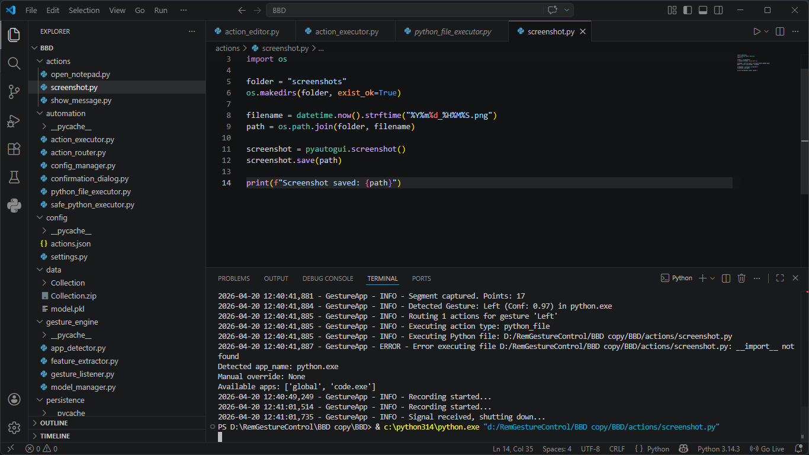
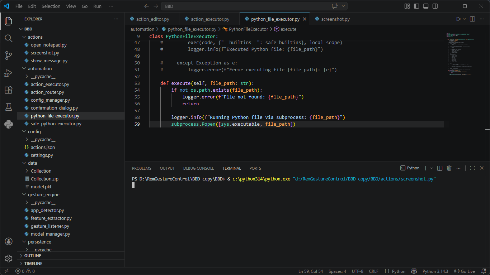

<!-- ===================== HEADER ===================== -->
<h1 align="center">🧠 RemGestureControl</h1>

<p align="center">
  <b>Control your entire productivity system using simple mouse gestures</b><br/>
  A powerful AI-assisted gesture automation engine for Windows
</p>

<p align="center">
  
</p>

---

<!-- ===================== BADGES ===================== -->
<p align="center">
  
  
  
</p>

---

## ⚡ Features

<div style="display: grid; grid-template-columns: 1fr 1fr; gap: 10px;">

- 🖱️ **Simple Mouse Gestures**  
  Record & use custom gestures via `Record.py`

- 📱 **App-Based Recognition**  
  Same gesture behaves differently per application

- 🐍 **Python Runner**  
  Execute Python scripts with gestures

- ⌨️ **Shortcut Automation**  
  Trigger keyboard shortcuts instantly

- 💻 **Command Runner**  
  Run terminal commands via gestures

- 🧠 **App Detection System**  
  Auto-detect active application (Auto / Manual mode)

- 🔗 **Multi-Action System**  
  One gesture → multiple actions

- 🔮 **Gesture Predictor**  
  Real-time gesture prediction while drawing

- ✨ **Animated Wand UI**  
  Magical cursor trail while performing gestures

- 🔐 **Safe Execution Layer**  
  Confirmation prompts for critical actions

</div>

---

## 📁 Project Structure

<details>
<summary><b>Click to expand structure</b></summary>

```

RemGestureControl/
│
├── main.py
├── model.pkl
├── gesture_config.db
├── Record.py
│
├── actions/
│   ├── open_notepad.py
│   ├── screenshot.py
│   └── show_message.py
│
├── automation/
│   ├── action_executor.py
│   ├── action_router.py
│   ├── python_file_executor.py
│   └── safe_python_executor.py
│
├── config/
│   ├── actions.json
│   └── settings.py
│
├── data/
│   ├── Collection/
│   └── assets/
│       ├── thumb.png
│       └── trail.png
│
├── gesture_engine/
├── intelligence/
├── persistence/
├── ui/
├── utils/
└── screenshots/

````

</details>

---

## 🚀 Installation

### 1. Clone the repository
```bash
git clone https://github.com/yourusername/RemGestureControl.git
cd RemGestureControl
````

### 2. Install dependencies

```bash
pip install -r requirements.txt
```

### OR (full environment)

```bash
pip install -r requirements_full.txt
```

### 3. Run the application

```bash
python main.py
```

---

## 🎮 How It Works

1. Draw a gesture using mouse
2. System captures motion path
3. AI model predicts gesture type
4. App context is detected (Chrome, VSCode, etc.)
5. Appropriate action is executed
6. Optional confirmation appears for safety

---

## 🧩 Customization

### ➕ Add New Gesture

Use:

```bash
python Record.py
```

Draw gesture 100–200 times for training accuracy.

---

### 🧠 Add Custom Actions

Place Python scripts inside:

```
/actions
```

They will be auto-detected by the system.

---

### 📦 Add Gesture Dataset

Place downloaded gestures in:

```
/data/Collection
```

---

## 🛠️ Utilities

* `AppDetector.py` → Detect active applications (.exe mapping)
* `Record.py` → Create new gesture datasets
* `gesture_engine/` → Core recognition system
* `intelligence/` → Prediction & AI enhancement layer

---

## 🖼️ UI Preview

<p align="center">
  
  
</p>

---

## 🔐 Safety System

RemGestureControl includes a **safe execution layer**:

* Confirmation dialogs for critical actions
* Sandboxed Python execution
* Controlled command execution environment

---

## 🧠 Built By

<p align="center">
  <b>PODEVS & Origin AI Labs</b><br/>
  <i>2026</i>
</p>

---

## 📜 License

This project is licensed under the **MIT License**

---

## 🌟 Vision

> “Computers should respond to intent, not clicks.”

RemGestureControl is built to transform productivity into **gesture-driven intelligence interaction**.

---